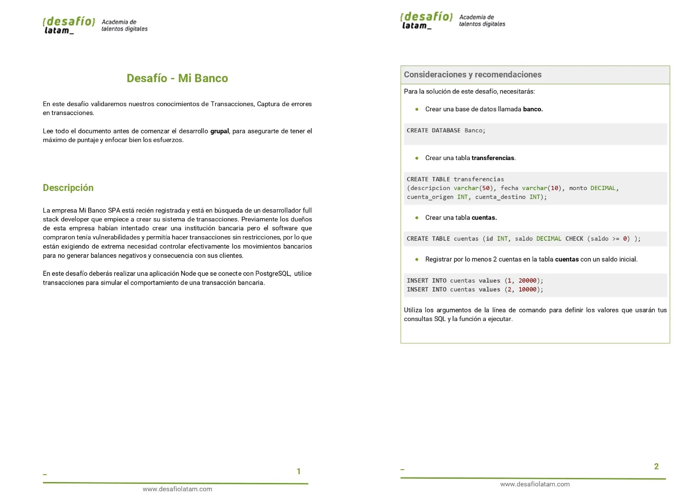
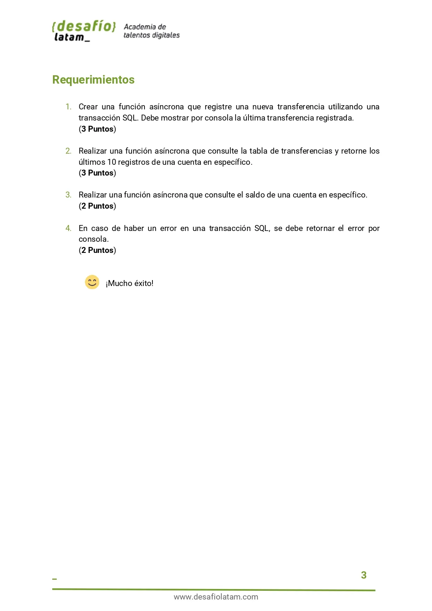
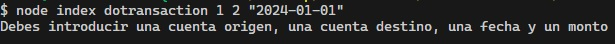
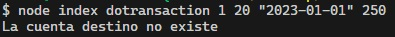
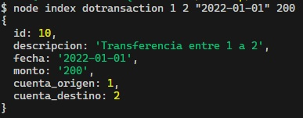
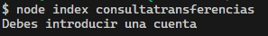
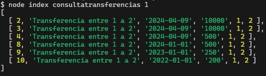
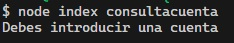
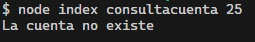
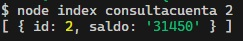

# Desafío Mi Banco

Repositorio con el código solución al desafío 3 **Mi Banco** perteneciente al módulo 7 **Acceso a datos en aplicaciones Node** de la beca **Desarrollo de aplicaciones Full Stack Javascript Trainee** dictada por Desafío Latam.

## Tabla de Contenido

- [Desafío Mi Banco](#desafío-mi-banco)
  - [Tabla de Contenido](#tabla-de-contenido)
  - [Requisitos](#requisitos)
  - [Soluciones](#soluciones)
    - [1.Crear una función asíncrona que registre una nueva transferencia utilizando una transacción SQL. Debe mostrar por consola la última transferencia registrada. (3 Puntos)](#1crear-una-función-asíncrona-que-registre-una-nueva-transferencia-utilizando-una-transacción-sql-debe-mostrar-por-consola-la-última-transferencia-registrada-3-puntos)
    - [2.Realizar una función asíncrona que consulte la tabla de transferencias y retorne los últimos 10 registros de una cuenta en específico. (3 Puntos)](#2realizar-una-función-asíncrona-que-consulte-la-tabla-de-transferencias-y-retorne-los-últimos-10-registros-de-una-cuenta-en-específico-3-puntos)
    - [3.Realizar una función asíncrona que consulte el saldo de una cuenta en específico.(2 Puntos)](#3realizar-una-función-asíncrona-que-consulte-el-saldo-de-una-cuenta-en-específico2-puntos)
    - [4. En caso de haber un error en una transacción SQL, se debe retornar el error por consola. (2 Puntos)](#4-en-caso-de-haber-un-error-en-una-transacción-sql-se-debe-retornar-el-error-por-consola-2-puntos)

## Requisitos




## Soluciones

He creado una clase en donde registro como métodos estáticos las funciones solicitadas para luego controlar cuál método ejecutar en base a los comandos ingresados en la consola utilizando el siguiente código:

```js
import Conexion from "./conexiones.js";

const argumentos = process.argv.slice(2);
const comando = argumentos[0];
const parametros = argumentos.slice(1);

const funciones = {
  dotransaction: Conexion.registerTransaction,
  consultatransferencias: Conexion.getLastTenTransactionFromCuenta,
  consultacuenta: Conexion.consultaCuenta,
};

if (comando) {
  funciones[comando](...parametros);
} else {
  console.log("Debes ingresar un comando");
}
```

### 1.Crear una función asíncrona que registre una nueva transferencia utilizando una transacción SQL. Debe mostrar por consola la última transferencia registrada. (3 Puntos)

He creado el siguiente método asíncrono que cumple lo pedido:

```js
static async registerTransaction(cuentaOrigen, cuentaDestino, fecha, monto) {
    if (!cuentaOrigen || !cuentaDestino || !fecha || !monto) {
      console.log(
        "Debes introducir una cuenta origen, una cuenta destino, una fecha y un monto",
      );
    } else {
      const pool = new Pool(config);

      const client = await pool.connect();
      try {
        await client.query("BEGIN");

        const descontar = {
          text: "UPDATE cuentas SET saldo = saldo - $2 WHERE id=$1 RETURNING *",
          values: [cuentaOrigen, monto],
        };
        const resultadoDescontar = await client.query(descontar);
        if (resultadoDescontar.rowCount === 0) {
          throw new Error("La cuenta origen no existe");
        }
        const acreditar = {
          text: "UPDATE cuentas SET saldo = saldo + $2 WHERE id=$1 RETURNING *",
          values: [cuentaDestino, monto],
        };

        const resultadoAcreditar = await client.query(acreditar);
        if (resultadoAcreditar.rowCount === 0) {
          throw new Error("La cuenta destino no existe");
        }

        const transferencia = {
          text: "INSERT INTO transferencias (descripcion,fecha,monto,cuenta_origen, cuenta_destino) VALUES ($1,$2,$3,$4,$5) RETURNING *",
          values: [
            `Transferencia entre ${cuentaOrigen} a ${cuentaDestino}`,
            fecha,
            monto,
            cuentaOrigen,
            cuentaDestino,
          ],
        };
        const transferenciaResult = await client.query(transferencia);
        console.log(transferenciaResult.rows[0]);

        await client.query("COMMIT");
      } catch (e) {
        await client.query("ROLLBACK");
        console.log(e.message);
      } finally {
        client.release();
      }
    }
  }
```

Si se intenta realizar alguna transacción y falta uno de los 4 parámetros requeridos entonces en consola se muestra lo siguiente:



Si se ingresa una cuenta que no existe entonces se muestra el siguiente mensaje:



Si se proporcionan los 4 parámetros y las cuentas de origen y destino existen entonces se muestra la última transacción creada:



### 2.Realizar una función asíncrona que consulte la tabla de transferencias y retorne los últimos 10 registros de una cuenta en específico. (3 Puntos)

He creado el siguiente método estático que cumple lo solicitado:

```js
static async getLastTenTransactionFromCuenta(cuenta) {
    if (!cuenta) {
      console.log("Debes introducir una cuenta");
    } else {
      const pool = new Pool(config);
      try {
        const consulta = {
          text: "SELECT * FROM transferencias WHERE cuenta_origen = $1 ORDER BY fecha desc LIMIT 10",
          values: [cuenta],
          rowMode: "array",
        };
        const result = await pool.query(consulta);
        console.log(result.rows);
        await pool.end();
      } catch (error) {
        console.log(error.message);
      }
    }
  }
```

Si se intenta consultar las transferencias sin una cuenta se muestra el siguiente mensaje:



Si se ingresa una cuenta y existe data entonces en consola se muestra lo siguiente:



### 3.Realizar una función asíncrona que consulte el saldo de una cuenta en específico.(2 Puntos)

He creado el siguiente método estático que cumple lo requerido:

```js
static async consultaCuenta(cuenta) {
    if (!cuenta) {
      console.log("Debes introducir una cuenta");
    } else {
      const pool = new Pool(config);
      try {
        const consulta = {
          text: "SELECT * FROM cuentas WHERE id = $1",
          values: [cuenta],
        };
        const result = await pool.query(consulta);
        if (result.rowCount === 0) {
          throw new Error("La cuenta no existe");
        }
        console.log(result.rows);
        await pool.end();
      } catch (error) {
        console.log(error.message);
      }
    }
  }
```

Si se intenta consultar el saldo de una cuenta sin ingresar una cuenta entonces en consola se muestra el siguiente mensaje:



Si se intenta consultar una cuenta que no existe entonces en la consola se muestra el siguiente mensaje:



Si existe la cuenta a consultar entonces en consola se muestra lo siguiente:



### 4. En caso de haber un error en una transacción SQL, se debe retornar el error por consola. (2 Puntos)

Como se puede observar en mis explicaciones anteriores y en el mismo código, he manipulado los errores que se presentan al realizar las consultas mediante bloques **try** y **catch** y mediante condicionales.
